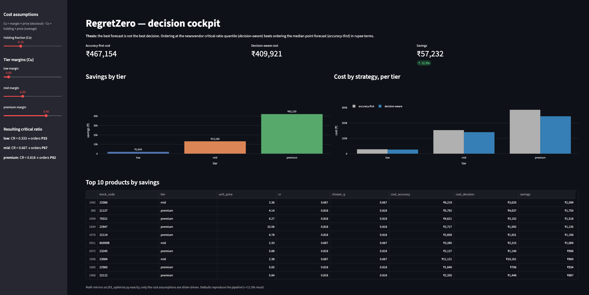

# RegretZero

**A decision-aware demand and inventory engine — because the best forecast is not the best decision.**

🔗 **Live demo:** [regret-zero.streamlit.app](https://regret-zero.streamlit.app)



---

Most demand-forecasting projects stop at one question: *how accurately can we predict sales?* RegretZero asks a different one: *given an uncertain forecast and the real cost of being wrong, how much should we actually order?*

The distinction matters. A standard model minimizes a symmetric error like RMSE, which treats over-ordering and under-ordering as equally bad. But in inventory they are not equal — a stockout forfeits a sale and maybe a customer, while overstock ties up capital and warehouse space. Optimizing for forecast accuracy quietly ignores that asymmetry. RegretZero optimizes for the decision instead.

On a held-out test set of real retail transactions, ordering at the cost-optimal quantile beat ordering at the median forecast by **₹57,232 — a 12.3% reduction in decision-regret** — with every product tier coming out ahead.

## The idea in one line

> Order at the newsvendor critical-ratio quantile of demand, not the median forecast. Measure success in the actual rupees lost from a wrong decision, not in RMSE.

## How it works

The pipeline runs in four stages, each building on the last.

**1. Data preparation** (`src/01_data_prep.py`) — Cleans roughly 1.07 million raw transactions from the UCI *Online Retail II* dataset down to 183,543 weekly product-demand records across 3,219 products. Cancellations, returns, and non-product admin codes (postage, bank charges) are removed; only products with at least 20 weeks of history are kept.

**2. Forecasting** (`src/02_forecast.py`) — Trains LightGBM quantile-regression models at five quantiles (P33 through P90). Weekly demand is extremely right-skewed (skewness ≈ 158), so a Gaussian point forecast would misprice the tail; quantile regression is rank-based and robust to it. Leakage is prevented three ways: a zero-filled per-product panel so lag features are genuinely causal, rolling statistics shifted before the window so the current week is never inside it, and a strict chronological train/validation/test split. P90 coverage lands at 91.8% against a 90% target.

**3. Optimization** (`src/03_optimize.py`) — Turns each forecast into an order using the newsvendor model. Each product's critical ratio — Cu / (Cu + Co) — determines which demand quantile to stock to. Products are tiered by price so the critical ratio genuinely varies (0.333 for low-margin items up to 0.818 for premium ones), and each orders its true cost-optimal quantile.

**4. Decision-regret benchmark** — Compares two strategies on held-out weeks: an accuracy-first baseline that orders the median forecast, and the decision-aware approach that orders the critical-ratio quantile. The realized cost is the asymmetric newsvendor cost, summed in rupees. Decision-aware wins by 12.3%.

The interactive [decision cockpit](https://regret-zero.streamlit.app) puts the cost assumptions on sliders, so you can change the holding cost or the tier margins and watch the optimal orders and the savings recompute live.

## Result

| Strategy | Total cost (test set) |
|---|---|
| Accuracy-first (order the median) | ₹467,154 |
| Decision-aware (order the CR quantile) | ₹409,921 |
| **Savings** | **₹57,232 (12.3%)** |

Every price tier comes out positive: low +6.8%, mid +8.6%, premium +14.8%.

A fuller writeup of the results, business impact, and limitations is in [reports/findings.md](reports/findings.md).

## Repository layout

```
regret-zero/
├── app/app.py              # Streamlit decision cockpit (deployed)
├── src/
│   ├── 01_data_prep.py     # clean + aggregate to weekly demand
│   ├── 02_demand_eda.py    # distribution analysis
│   ├── 02_forecast.py      # LightGBM quantile forecasting
│   └── 03_optimize.py      # newsvendor optimizer + decision-regret
├── reports/                # decision notes (outliers, calibration)
├── data/sample.csv         # small runnable sample
└── requirements.txt
```

## Running it locally

```bash
python -m venv venv
source venv/bin/activate
pip install -r requirements.txt
```

On macOS, LightGBM needs the OpenMP runtime, which the pip wheel does not bundle. Install it once with Homebrew (it cannot come from pip):

```bash
brew install libomp
```

Then run the pipeline from the project root:

```bash
python src/01_data_prep.py
python src/02_forecast.py
python src/03_optimize.py
streamlit run app/app.py
```

## A note on the cost assumptions

The dataset has no cost data, so the stockout and holding costs are transparent, configurable assumptions set at the top of `src/03_optimize.py`. The contribution here is the framework and the relative result, not the exact rupee figure — decision-aware ordering wins across a wide range of cost settings, which the live dashboard lets you verify for yourself. Two modelling decisions are written up in `reports/`: why extreme demand weeks are kept rather than capped, and why the lower quantiles are deliberately left as-is given the intermittent-demand data.

## License

MIT — see [LICENSE](LICENSE).
