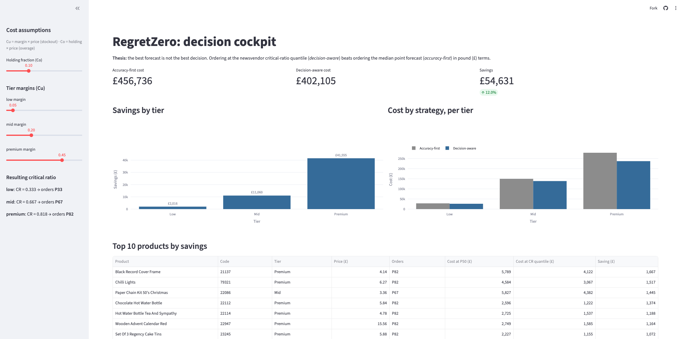

# RegretZero

Inventory ordering that is scored on money lost, not on forecast error. Built on two years of real transactions from a UK online giftware retailer.

Live dashboard: [regret-zero.streamlit.app](https://regret-zero.streamlit.app)



## Why I built this

Most demand-forecasting projects stop at accuracy: train a model, report RMSE or MAPE, done. A retailer doesn't act on a forecast, though. It acts on an order, and the two ways an order can be wrong don't cost the same. Running short loses the margin on every sale you couldn't make. Ordering too much leaves stock sitting on the shelf for another week. RMSE treats both mistakes as equal, so a model tuned for RMSE is tuned for the wrong target.

RegretZero keeps the forecast and changes the decision. For each product it compares what a missed sale costs with what a leftover unit costs, then orders the demand quantile that balances the two. This is the newsvendor rule from operations research. Success is measured in pounds lost on the held-out weeks.

On 12 held-out weeks, ordering this way cost **£54,631 less** than ordering the median forecast, a **12.0%** reduction. All three price tiers came out ahead.

## How it works

**1. Data preparation** (`src/01_data_prep.py`). The raw file has 1,067,371 transaction lines. Orders that were cancelled in full within 24 hours are dropped along with their cancellation, since they never turned into real demand. After that the script removes the remaining cancellations and returns, non-product codes (postage, bank charges, manual adjustments), and products with fewer than 20 weeks of sales. The result is 183,459 product-weeks across 3,218 products.

**2. Forecasting** (`src/02_forecast.py`). LightGBM quantile regression at P33, P50, P67, P82 and P90. Weekly demand is heavily right-skewed (median 15 units, skewness about 21), so the models predict quantiles directly instead of assuming a normal distribution. Three things keep the test honest:

- Every product sits on a continuous weekly calendar with empty weeks filled as zero, so "last week" always means the previous calendar week.
- Rolling features are shifted before the window is taken, so a week never sees its own demand.
- Train, validation and test are split strictly by date.

On the test weeks, the P90 forecast covers 91.7% of actual demand against a 90% target.

**3. Ordering** (`src/optimizer.py`, `src/03_optimize.py`). The critical ratio is Cu / (Cu + Co), where Cu is the margin lost per unit short and Co is the cost of one unit left over. The cost-optimal order is the demand quantile at that ratio. Products are split into three price tiers with different margins, so the ratio runs from 0.333 for cheap, thin-margin items to 0.818 for premium ones. Each product orders the nearest trained quantile.

**4. Scoring.** Both strategies are scored on the same held-out weeks with the same asymmetric cost. The baseline orders P50. The decision-aware strategy orders the critical-ratio quantile.

All of the ordering math lives in `src/optimizer.py`. The pipeline and the dashboard both import it, so the dashboard shows the same numbers as this page.

## Results

| Strategy | Cost over 12 test weeks |
|---|---|
| Order the median forecast (P50) | £456,736 |
| Order the critical-ratio quantile | £402,105 |
| **Saving** | **£54,631 (12.0%)** |


By tier the saving is 7.1% (low), 7.4% (mid) and 14.9% (premium). Premium gains the most because a missed sale there costs the most, so stocking deeper pays for itself.

The exact figure depends on the cost assumptions, so the dashboard puts them on sliders. The chart below sweeps the holding cost with everything else at default. The decision-aware strategy stays ahead until holding cost reaches about 26% of unit price per week. The default is 10%.


The full write-up, including a check on how data cleaning affects the result and the known limitations, is in [reports/findings.md](reports/findings.md).

## About the cost numbers

The dataset has prices but no costs, so the costs are assumptions, all set at the top of `src/optimizer.py`:

| Tier | Margin (share of price) | Critical ratio | Orders |
|---|---|---|---|
| Low | 5% | 0.333 | P33 |
| Mid | 20% | 0.667 | P67 |
| Premium | 45% | 0.818 | P82 |

Holding cost is 10% of unit price per week for every tier. The margins sit below typical gross retail margins on purpose, because a stockout doesn't always lose the full sale. Using full gross margins (27% / 40% / 60%) makes the saving larger (£158,124 (21.2%)), so 12.0% is the conservative number.

All money figures are in pounds sterling, the currency of the source data.

Two modeling decisions have their own notes: [keeping extreme demand weeks](reports/01_outlier_decision.md) and [why the lower quantiles over-cover](reports/02_calibration_note.md).

## Running it

### Setup

```bash
python -m venv venv
source venv/bin/activate
pip install -r requirements.txt
```

The numbers on this page reproduce only with the exact versions pinned in `requirements.txt`. I verified them on Python 3.11.15. Other pandas or numpy versions change the LightGBM forecasts slightly, and with them the headline.

On macOS, LightGBM also needs the OpenMP runtime, which pip can't install:

```bash
brew install libomp
```

### Data

The raw data isn't in the repo. Download [Online Retail II](https://archive.ics.uci.edu/dataset/502/online+retail+ii) from the UCI Machine Learning Repository. It is one Excel file, `online_retail_II.xlsx`, with two sheets (`Year 2009-2010` and `Year 2010-2011`). The pipeline reads a single CSV, so stack the sheets first:

```bash
python -c "import pandas as pd; pd.concat(pd.read_excel('online_retail_II.xlsx', sheet_name=None, dtype={'Invoice': str, 'StockCode': str}).values(), ignore_index=True).to_csv('data/online_retail_II.csv', index=False)"
```

Reading the Excel file takes a few minutes. The CSV should have 1,067,371 rows. No deduplication is applied.

### Pipeline

From the project root:

```bash
python src/01_data_prep.py
python src/02_forecast.py
python src/03_optimize.py
python src/04_make_figures.py
streamlit run app/app.py
```

## Repository layout

```
regret-zero/
├── app/app.py              Streamlit dashboard (deployed)
├── src/
│   ├── 01_data_prep.py     cleaning and weekly aggregation
│   ├── 02_demand_eda.py    demand distribution check
│   ├── 02_forecast.py      LightGBM quantile models
│   ├── optimizer.py        newsvendor logic shared by pipeline and dashboard
│   ├── 03_optimize.py      orders and cost comparison
│   └── 04_make_figures.py  charts used in this README and the reports
├── reports/                findings and modeling notes
├── assets/                 dashboard screenshot and charts
├── data/sample.csv         first 1,000 rows of data/demand.csv, for a quick look
└── requirements.txt
```

## License

MIT. See [LICENSE](LICENSE).
