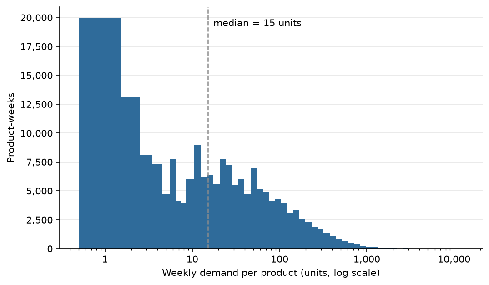

# Decision note: keeping extreme weekly-demand values

**Date:** 2026-06-27
**Status:** Decided (pending mentor review)
**Scope:** `data/demand.csv` (product × week demand, 183,459 rows, 3,218 products)
**Updated:** 2026-09-18. Statistics refreshed after the cancellation fix (see Follow-up).

## Context

The weekly-demand distribution is extremely right-skewed:

| Statistic | Value |
|---|---|
| Median | 15 units |
| Mean | 57.8 units (mean / median = 3.85×) |
| Skewness | ≈ 21 (20.8) |
| p99 | 613 |
| p99.9 | 1,858 |
| Max | 12,786 |

Weekly demand per product-week on a log scale, with the median marked.

(See `assets/demand_distribution.png` and `src/02_demand_eda.py`.)

A 1.5×IQR rule flags ~11.8% of rows as "outliers," but that is the IQR rule
misfiring on a skewed, heavy-tailed distribution, not 11.8% of rows being
data errors. The main feature is a long, real tail of high-volume weeks
(likely wholesale/bulk orders).

## Decision

**We do NOT cap or winsorize the extreme values.**

## Rationale

- Forecasting uses **LightGBM quantile regression (pinball loss)**, which is
  robust to outliers by design: quantile estimates depend on the *rank* of
  observations, not their magnitude. A few enormous weeks move a target
  quantile far less than they would move a mean.
- This is the opposite of **mean-based safety stock** (mean ± k·σ),
  where σ = 172 on a median of 15 is dominated by the tail and would produce
  absurd stocking levels. Avoiding that fragility is the reason we chose the
  quantile approach in the first place.
- The extreme weeks are plausibly real demand (bulk/wholesale orders).
  Discarding them would bias high-quantile forecasts (P90/P95/P99) downward,
  and those are the quantiles that matter most for avoiding stockouts.

## Follow-up: resolved 2026-09-18

- ~~Spot-check a handful of the largest weeks to confirm they are genuine
  orders rather than data-entry artifacts. If any are clearly errors, handle
  them as data-quality fixes, separately from this modeling decision.~~

  **Resolved (2026-09-18).** The largest week, a 74,215-unit order of
  StockCode 23166 (invoice 541431), was reversed 16 minutes later by
  cancellation C541433 from the same customer. Searching the raw data for
  order/cancellation pairs (same Customer ID, StockCode and absolute
  Quantity, cancellation after the order) found 6,476 pairs. The 1,395 pairs
  reversed within 24 hours are now removed in `src/01_data_prep.py`
  (`MAX_CANCEL_LAG_HOURS = 24`). Later cancellations are kept, since they
  may be returns of stock that did ship. This was handled as a data-quality
  fix, as planned: skewness fell from ≈ 158 to ≈ 21 and the max from 74,215
  to 12,786, and the table above shows the post-fix statistics. The decision
  above stands. The distribution is still heavily right-skewed, and the
  remaining large weeks are kept, not winsorized.
