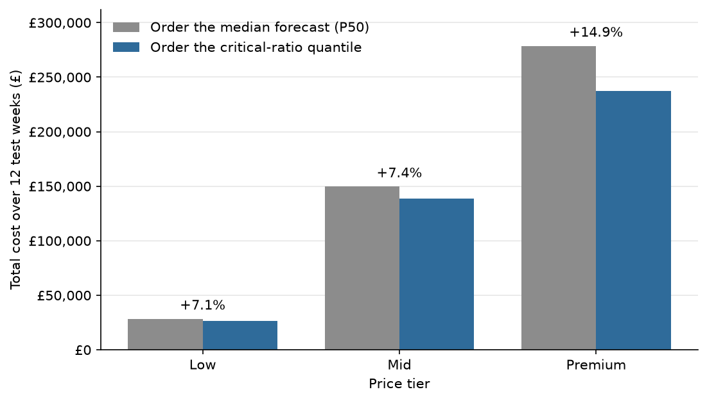
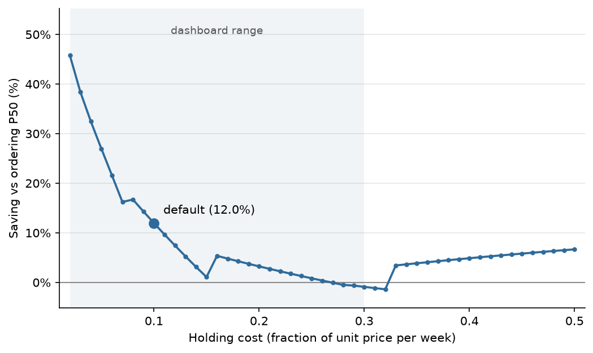

# RegretZero: findings

## What I tested

Forecasting models are usually judged on how close the prediction lands to actual sales. That scoring is symmetric: being 10 units high counts the same as being 10 units low. Inventory isn't symmetric. A stockout loses the margin on sales that never happen; extra stock costs a week of holding. Which mistake is worse depends on the product.

The claim under test: for the same forecast model, ordering at each product's cost-optimal quantile is cheaper than ordering the median forecast. The forecast doesn't get any more accurate. Only the ordering rule changes. Everything is measured in pounds lost on held-out data.

## Headline result

Test set: the last 12 weeks of the data (from 19 September 2011 to the final transactions on 9 December 2011), 3,218 products.

| Strategy | Cost over 12 weeks |
|---|---|
| Order the median forecast (P50) | £456,736 |
| Order the critical-ratio quantile | £402,105 |
| **Saving** | **£54,631 (12.0%)** |

Product by product, the decision-aware rule was cheaper for 1,677 products, more expensive for 1,015 and tied for 526. It loses on more products than a 12% headline might suggest, and that is expected. Moving an order away from the median trades one kind of mistake for the other, so on many individual products it comes out slightly worse. The overall win comes from the products where that trade pays off heavily. The top 1% of products (32 items) account for about 43% of the total saving.

## By price tier

| Tier | Critical ratio | Quantile ordered | Saving |
|---|---|---|---|
| Low | 0.333 | P33 | +7.1% |
| Mid | 0.667 | P67 | +7.4% |
| Premium | 0.818 | P82 | +14.9% |

Premium saves the most, which is what the theory predicts. High margin makes a stockout expensive, so the rule stocks deeper, and the avoided stockouts outweigh the extra holding cost.

## How much the cost assumptions matter

The dataset has no cost data, so margins and holding cost are assumptions (details in the README and at the top of `src/optimizer.py`). The fair question is whether 12.0% is an artifact of those choices.

Sweeping the holding cost with margins fixed:

- The saving stays positive up to a holding cost of about 26% of unit price per week (+0.38% at 0.26, −0.07% at 0.27). The default is 10%. The curve isn't smooth on the way there: it dips to +1.0% around 0.15 before recovering, for the same snapping reason explained below.
- It is slightly negative from 0.27 to 0.32, where the extra stock finally costs more than the stockouts it prevents.
- It turns positive again from 0.33 (+3.4% there, +4.9% at 0.40). This isn't a bug. Each product snaps to the nearest of the five trained quantiles, so as holding cost rises, whole tiers jump to a lower quantile at once and the curve moves in steps. The dashboard sweep stops at 0.30; the points above that were computed offline with `optimizer.score`.

On margins: I kept them below typical gross retail margins on purpose. Plugging in full gross margins (27% / 40% / 60%) raises the saving to 21.2%, partly because the low tier then orders P67 instead of P33. The pound figure isn't comparable to the headline, since higher margins also make every stockout cost more. Either way, 12.0% is the conservative end.

## How much data cleaning matters

The raw data has 6,476 orders that were later cancelled in full by the same customer, for the same product and quantity. Some were reversed within minutes; most were cancelled days or weeks later. One of them was an order for 74,215 units of a ceramic storage jar, cancelled 16 minutes after it was placed. Before this was handled, that one row produced most of the skew in the demand distribution (skewness 158 with it, about 21 without).

I ran the full pipeline three ways:

| Cleaning variant | Pairs removed | Saving |
|---|---|---|
| A: keep every order | 0 | £57,232 (12.3%) |
| **B: drop pairs cancelled within 24 hours (used)** | **1,395** | **£54,631 (12.0%)** |
| C: drop every matched pair | 6,476 | £47,953 (10.8%) |

B is the version used everywhere else in the project. An order reversed within a day most likely never shipped, so it never took stock off a shelf. A cancellation weeks later may be a return of goods that did ship, and the stock still had to be there when the order came in, so those orders stay. The data doesn't say which cancellations were returns, so this is a judgment call, which is why all three variants are shown. The decision-aware rule wins under all three, and every tier stays positive.

## In business terms

Scaled from 12 weeks to a year (×52/12), the saving is about **£237,000**, from changing only the ordering rule, with the same model and the same data. Weekly demand in the test window ran about 1.45 times the average of earlier weeks, since it covers the run-up to Christmas, so this scaling probably overstates the annual figure. Treat the annual figure as a rough order of magnitude, not a forecast.

## Why I trust the number

- **No leakage.** Lags and rolling statistics use only past weeks of the same product, and the split is purely by date. I rebuilt the features independently to check this.
- **Reproducible.** With the versions pinned in `requirements.txt` (verified on Python 3.11.15), a clean end-to-end run reproduces every output file byte for byte. The pinning matters: running the unchanged pipeline under pandas 2.3.3 and numpy 2.2.6 moved the Variant A headline from 12.3% to 12.2%, because the forecasts shift slightly.
- **Checked separately.** The headline was recomputed outside the pipeline and matched it to the pound.
- **One copy of the math.** The pipeline and the dashboard both import `src/optimizer.py`. When I moved the logic into that module, the results file came out with the same checksum as before.
- **Calibration.** The top quantiles are close to target: P82 covers 86.1% and P90 covers 91.7%. P67, which the mid tier orders, over-covers by about 8 points (75.0%). The lower quantiles are further off; see the limitations below.

## Limitations

- **Costs are assumed.** They are grounded in published retail margins but not measured from this retailer. The method and the relative result carry over; the exact pound figure does not.
- **Lower quantiles over-cover.** P33 covers 52.0% instead of 33.3%, because many product-weeks have zero sales and a forecast near zero counts as covering them. The effect shrinks toward the top quantiles. Details in [02_calibration_note.md](02_calibration_note.md).
- **Nearest-quantile snapping.** Each product orders the closest of five trained quantiles, not its exact critical ratio. A denser grid would remove the steps in the sensitivity curve.
- **One-period model.** Each week is scored on its own, so leftover stock doesn't carry into the next week the way it would in a real warehouse, and one week's excess never reduces the next week's order. A multi-period simulation would be the proper test.
- **One test window.** The test covers one 12-week stretch. A rolling backtest over several windows would show how stable the saving is across seasons.

## Summary

For the same forecasts, ordering at each product's critical-ratio quantile cut the cost of ordering mistakes by 12.0% on held-out data, and the premium tier, where the theory says the gain should be largest, gained the most. The result holds across a wide range of holding costs and all three data-cleaning choices.
